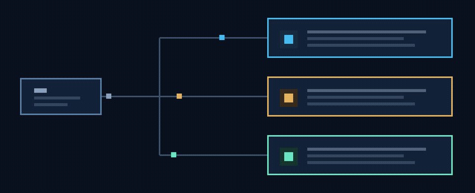
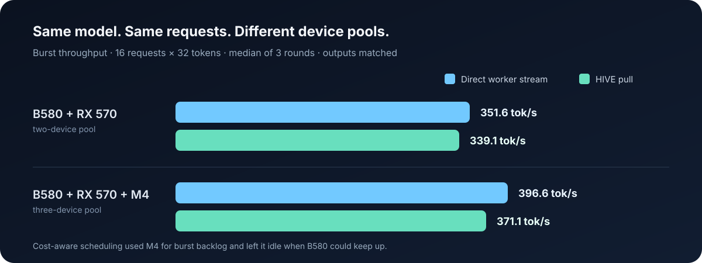

<div align="center">

# SeedPlane

### Local AI, powered by the computers you already own.

Pool the GPUs and CPUs in your gaming PC, Linux workstation, and Mac to run AI at home—without sending prompts to a cloud service.


**One home lab. Several kinds of hardware. One place to coordinate the work.**

[See what works](#what-works-today) · [Read the latest test](#the-latest-real-hardware-test) · [Run SeedPlane](#try-it)

</div>

---

## What SeedPlane is

SeedPlane is an open-source research project for combining **local AI runtimes across different machines and accelerators**. Instead of buying one bigger server, the idea is to make the devices you already own cooperate—while keeping models and prompts on your own network.

The project explores two related ways to use that hardware:

- **More work at once:** send independent requests to available devices. This is the part the current HIVE pull-agent prototype tests.
- **Faster single answers:** let draft models propose continuations and have a target model verify them in batches. This is a research direction, not a working multi-device feature yet.

These are different goals. Adding GPUs can increase total requests served without making one answer arrive sooner.

## What works today

- The native Qwen runtime has been tested on an **Intel Arc B580**, **AMD Radeon RX 570**, and **Apple M4**.
- Persistent HIVE agents can connect the three machines and pull compatible requests from a coordinator.
- On the tests below, distributed and direct paths produced **identical generated token sequences**.
- SeedPlane also contains a separate long-context research runtime. It splits prompt processing into windows; this can trade model quality for speed, so results are workload-dependent.

This is an experimental prototype—not yet a one-click cluster manager. Each machine needs a compatible local runtime and model bundle. HIVE currently distributes **independent requests**; it does not combine GPU memory or divide one autoregressive answer across the network.

## How the HIVE test works

The coordinator holds ready requests. Each machine keeps its model loaded, asks for compatible work when it is free, and returns its result. A fast device can pull again without waiting for a slower one to finish its request.

<p align="center"></p>

The picture shows **separate requests being served by separate workers**—not pieces of one answer being computed by all three GPUs. The current pull path uses persistent authenticated TCP on a trusted LAN; authentication does not encrypt traffic.

## The latest real-hardware test

Three GPUs, all three two-device pairs, and the full trio were tested with the same model, prompt, and greedy output. Each condition ran three rounds of **16 requests × 32 tokens**. Every output matched.

<p align="center"></p>

| Pool | Direct worker stream | HIVE pull agents |
|---|---:|---:|
| B580 + RX 570 | **362.7 tok/s** | 339.0 tok/s |
| B580 + RX 570 + M4 | 330.6 tok/s | **340.1 tok/s** |

The trio's HIVE path was about **1.05×** its direct path in this experiment. But the direct two-GPU pair was still faster than the three-GPU pool. That is the honest result: persistent coordination looks promising, while **the M4 did not raise the measured throughput ceiling in this run**. Three rounds are an early signal, not a final performance claim.

These numbers measure **aggregate throughput for independent requests**, not the time to generate one answer. The full results include individual devices, all pairings, per-request timings, assignments, and limitations:
[benchmark results](experiments/hive_scaling/RESULTS.md) · [raw measurements](experiments/hive_scaling/hive_fleet_matrix_v1_16x32_3rounds_20260924.json) · [HIVE implementation plan](docs/HIVE_IMPLEMENTATION_BASELINE.md).

## What is not built yet

- No measured-cost scheduler that learns which device should receive each request.
- No genuine batched inference API for the native runtime.
- No multi-drafter speculative runtime or batched/tree verifier across devices.
- No shared VRAM, global KV cache, or layer-by-layer tensor sharding over the home network.
- No automatic secure pairing or one-command setup for a mixed-device cluster.

The next work is to use measured service times to improve assignment and lease sizes, then test real batching. Only after that does it make sense to claim a fleet-wide speedup. The longer-term latency experiment is speculative decoding: use other devices to draft candidates, then verify useful candidates in fewer target-model passes.

## Try it

For a quick tour of the project:

```bash
git clone https://github.com/robson-apk/SeedPlane.git
cd SeedPlane
python3 demo.py
```

To install the Python tools and inspect the available commands:

```bash
python3 -m pip install -e .
seedplane --help
```

The **native Vulkan runtime** has separate build and model instructions in the [runtime guide](native/vulkan_decode/README.md). The Python [API guide](docs/API.md) explains the existing long-context and worker interfaces. HIVE's experimental agent protocol and reproducible tests are in [`experiments/hive_scaling`](experiments/hive_scaling/PROTOCOL.md).

## Research and project map

SeedPlane also investigates long-context attention, heterogeneous prefill, speculative decoding, and their quality/performance trade-offs. The results are organized by experiment; failed hypotheses and regressions are kept alongside successful runs.

- [Latest HIVE scaling results](experiments/hive_scaling/RESULTS.md)
- [HIVE architecture baseline](docs/HIVE_IMPLEMENTATION_BASELINE.md)
- [Speculative forest prototype](docs/speculative-forest-prototype.md)
- [Native runtime and builds](native/vulkan_decode/README.md)
- [Full experiment archive](experiments/)

## License

SeedPlane is released under the [MIT License](LICENSE).

<div align="center"><sub>Built in a home lab. Measured on real hardware. Claims kept smaller than the evidence.</sub></div>
