<h1 align="center">SeedPlane</h1>

<p align="center">
  <b>Make the computers you already own work together to run local AI.</b><br>
  Your gaming PC, Linux machine, and Mac can become one private pool for AI workloads.
</p>

SeedPlane is an experiment in combining the GPUs and CPUs already sitting at home. The goal is simple: keep AI on your
own devices, share independent work between them, and get more done than one computer can alone.

<p align="center">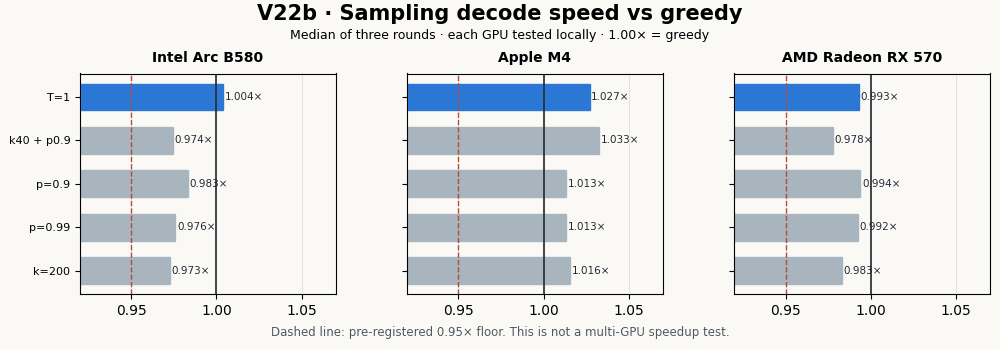</p>

### What works today

- The native local model runtime builds and runs on **Intel Arc B580**, **AMD Radeon RX 570**, and **Apple M4**.
- A first two-computer test processed a batch of independent requests **1.38× faster** with B580 + RX 570 than with the B580 alone. The outputs matched.
- A later three-device test kept every output identical. On a burst of queued requests, B580 + RX 570 + M4 reached **1.44×** the B580's median throughput—but it missed the pre-set 1.50× goal. With one request arriving per second, the trio added **no throughput** and its worst completion time was about **3.8× longer** than B580 alone.
- This remains experimental, not a plug-and-play cluster. The X79's RX 570 was connected at only 100 Mb/s, so the result is network-conditioned; and neither test split one answer's generation across GPUs.

The next milestone is a better-connected rerun with a scheduler that only admits slower devices when they improve the workload, then comparing throughput and tail latency again.

<p align="center">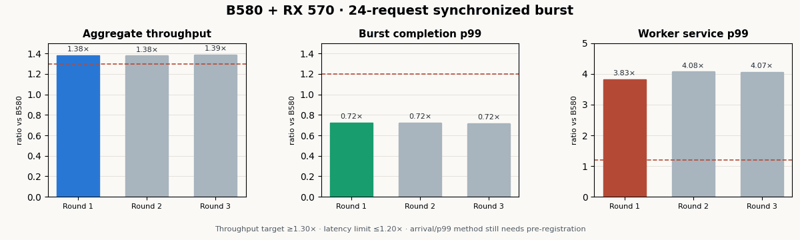</p>

The first full comparison has now run: all three individual devices, all pairs, and the trio, under both burst and steady
arrivals. The [protocol](experiments/trio_v27/PROTOCOL.md), [results and limitations](experiments/trio_v27/RESULTS.md),
and [raw per-request data](experiments/trio_v27/results_20260924_exploratory.json) are public. It confirms the hardware
can share a deterministic workload, but the speedup and latency goals remain unproven until the network and scheduler
are improved.

Want to help test it? Start with the [native runtime guide](native/vulkan_decode/README.md). SeedPlane is alpha research software; below are the detailed results, trade-offs, and experiments that explain what is and is not proven.

---

## Research background

SeedPlane also explores splitting long prompts into independent windows for parallel processing. This changes the model's attention pattern, so quality depends on shard and halo sizes: +8–10% perplexity at 4k tokens with S=512/H=256 (V20). The results and failed hypotheses are documented below.

<p align="center">
  <a href="LICENSE">MIT License</a> &nbsp;·&nbsp;
  <a href="experiments/v8/RESULTS.md">Open benchmark results</a> &nbsp;·&nbsp;
  <a href="experiments/">Pre-registered experiments</a> &nbsp;·&nbsp;
  CPU, Intel Arc &amp; Apple Silicon
</p>

<p align="center">
  <picture>
    <source media="(prefers-color-scheme: dark)" srcset="docs/img/hero-race-dark.gif">
    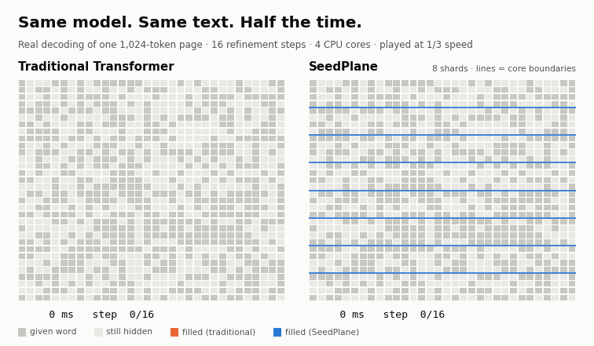
  </picture>
</p>

<div align="center">

| 🚀 **2.0× faster** | ⚡ **682 vs 341 tok/s** | 🎯 **+0.4 to +1.4 pp accuracy** | 🧮 **6.4× less attention work** |
|:---:|:---:|:---:|:---:|
| 760 ms vs 1,555 ms per 1,024-token page | 6 CPU cores; 1.6× faster even on 1 core | same model, same text, 3/3 seeds | 51× less at 8,192 tokens |

<sub>Same checkpoint · same inputs · same CPU cores (Ryzen 5600X) · criteria committed to git <i>before</i> each run — <a href="experiments/v8/RESULTS.md">V8</a> · <a href="experiments/v9/RESULTS.md">V9</a></sub>

</div>

---

## New: real models, real kernels — Qwen2.5 on llama.cpp

SeedPlane now runs **existing GGUF models, unchanged**, on top of llama.cpp's own kernels (`native/seedplane-worker.cpp`).
No retraining. Same file, same GPU, same kernels — only the attention pattern and the scheduling change.

<div align="center">

| ⚡ **5.0× faster** at 16k tokens | 🎯 **same perplexity** (−0.2%) at **1.84×** | 🧠 **32× smaller KV cache** at 32k | 🧭 **48× faster** than llama.cpp's default split |
|:---:|:---:|:---:|:---:|
| 19,413 vs 3,891 tok/s on an Arc B580 | 16k tokens, halo 4,096, 3 fresh text chunks | 12 MiB vs 387 MiB | B580 + CPU: planner 10,822 vs default 224 tok/s |

<sub>Qwen2.5-0.5B-Instruct F16 · Intel Arc B580 (Vulkan) · WikiText-2 · criteria committed before each run — <a href="experiments/v13/RESULTS.md">V13</a> · <a href="experiments/v13c/RESULTS.md">V13c/d</a> · <a href="experiments/v14/">V14</a></sub>

</div>

<p align="center">
  <picture>
    <source media="(prefers-color-scheme: dark)" srcset="docs/img/qwen_speed-dark.svg">
    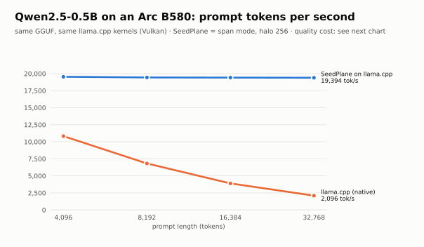
  </picture>
</p>

**Speed is not free — so we show the price.** Each point is one halo size. At 16k tokens, a 4,096-token halo matches the
original model's perplexity at 1.84× the speed. At 32k the same halo costs +2.2% (3.2× faster), so a fixed halo does **not**
keep quality as texts get longer. That one is logged as a falsified claim.

<p align="center">
  <picture>
    <source media="(prefers-color-scheme: dark)" srcset="docs/img/qwen_frontier-dark.svg">
    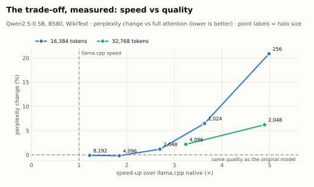
  </picture>
</p>

<p align="center">
  <picture>
    <source media="(prefers-color-scheme: dark)" srcset="docs/img/qwen_kv_memory-dark.svg">
    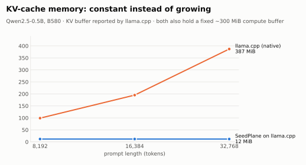
  </picture>
</p>

### How the work is shared

<p align="center">
  <picture>
    <source media="(prefers-color-scheme: dark)" srcset="docs/img/scheduler-dark.gif">
    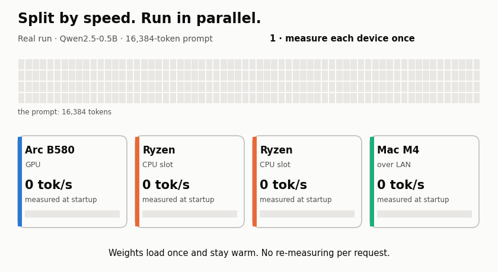
  </picture>
</p>

| Step | What happens | Measured |
|---|---|---|
| **1 · Measure once** | Each device is timed at startup (network included); weights stay loaded | no per-request cost |
| **2 · Split by speed** | Each device gets what it can finish by a common deadline; too slow → waits for the next request | 0.97–1.21× the planned speed |
| **3 · Run in parallel** | One message per piece, binary protocol, halo reused in the KV cache | coordinator = 0.1–0.3% of time |

For short independent requests, `run_batch(...)` uses a shared queue instead of putting a slow device in one request's
critical path. Full-job calibration and a tail guard admit each device only above its measured break-even queue depth.
On 18 queued 4k requests, B580 + Mac improved aggregate throughput by **5.79%** and **5.18%** in two runs; at 17, the
gain-preserving policy correctly leaves the Mac waiting. See [V16](experiments/v16/RESULTS.md).

```bash
python -m seedplane.probe --model qwen.gguf --worker ./seedplane-worker          # which API/device layout is fastest here?
./seedplane-worker -m qwen.gguf --dev Vulkan0 --port 54000                        # GPU worker (weights loaded once, kept warm)
./seedplane-worker -m qwen.gguf --dev CPU --slots 3 -t 2 --port 54001             # 3 CPU slots sharing one copy of the weights
```
Full API: [docs/API.md](docs/API.md).

### Native SeedPlane runtime (experimental)

`native/vulkan_decode` runs the SeedPlane model itself, with shard-window attention and window-local KV caches, on
any Vulkan GPU. It needs no PyTorch, Transformers or llama.cpp at run time. Tokenizer, sampling, chat template and
session state are all inside the engine.

```bash
seedplane convert ./qwen05.sp ./qwen05-native.sp --native      # seedplane-bundle/2: FP16 weights + plan + tokenizer
cmake -S native/vulkan_decode -B native/vulkan_decode/build && cmake --build native/vulkan_decode/build --config Release
seedplane chat ./qwen05-native.sp --native                     # streamed chat; or: qwen_vk <bundle> --chat
```

Measured on an Arc B580 with Qwen2.5-0.5B at 3–4k tokens of context
([V18](experiments/v18/RESULTS.md) → [V21](experiments/v21/RESULTS.md)):

| | tok/s | note |
|---|---:|---|
| PyTorch eager decoder (V17) | 18 | launch-bound: ≤ 8.5% GPU busy |
| native, full attention | 250 | split attention kernel (V20) |
| **native, SeedPlane plan** | **267** | exact vs a from-scratch window oracle; KV 19 MB vs 99 MB |
| native, SeedPlane plan, sampling T=0.7/k=40/p=0.9 | 246 | pre-registered cost gate (≥ 0.95×) **failed**: 0.92× |

The native tokenizer matches HF `tokenizers` token for token on all of WikiText-2 (298,938 tokens). The SeedPlane plan
still costs +8–10% perplexity at 4k tokens (S=512/H=256) vs full attention. Qwen2 family only, one GPU measured.

#### V22b: Vulkan sampling and three-device validation

V22b moves top-k/top-p selection and sampling to Vulkan for the native decoder. Builds were tested on three hosts:
Ryzen 5 5600X + Intel Arc B580 (Windows), Apple M4 (MoltenVK), and Xeon E5-2650 v2 + Radeon RX 570 (RADV). All three
passed the pre-registered fixed-mode
decode-speed floor (each sampling configuration ≥0.95× greedy on that same device). This is a per-device runtime result,
not evidence that combining devices speeds up one decode.

| Device | Median greedy | T=1 | k40+p0.9 | p0.9 | p0.99 | k200 |
|---|---:|---:|---:|---:|---:|---:|
| Arc B580 | 264 tok/s | 1.004× | 0.974× | 0.983× | 0.976× | 0.973× |
| Apple M4 | 64.9 tok/s | 1.027× | 1.033× | 1.013× | 1.013× | 1.016× |
| Radeon RX 570 | 116.6 tok/s | 0.993× | 0.978× | 0.994× | 0.992× | 0.983× |

The fixed G1 distribution gate passed 47/48 cases; the remaining high-support case measured TV 0.04673 against a strict
0.01 threshold at one million draws. It is recorded as a failure, not waived. G3 greedy regression and G4 session/CLI
passed on Windows; the same session-continuation check passed on macOS and Linux. The experiment, raw measurements,
reproduction scripts, protocol, and known limitations are in [`experiments/v22b/`](experiments/v22b/RESULTS.md).

An initial two-node batch feasibility test sent 24 independent 128-token requests through persistent SSH streams:
B580 alone reached 273.6 tok/s median, versus 378.4 tok/s on B580 + RX570 (**1.381× aggregate**). All output tokens
matched. For a synchronized 24-request burst, p99 completion from batch arrival improved from ~11.2 s to ~8.1 s because
the queue drained faster. Individual worker service p99 moved the other way (~0.48–0.51 s on B580 versus ~1.95 s in the
pool, driven by RX570 tasks). The V26 arrival pattern/p99 definition was not pre-registered in this exploratory run, so
neither result counts as formal latency-gate acceptance. This experimental harness is not the `seedplane` network
worker/pool and does not accelerate one request cooperatively; production integration and a pre-registered latency test
remain future work. Full data and caveats are in
[`experiments/v22b/RESULTS.md`](experiments/v22b/RESULTS.md). Build prerequisites and commands are in
[`native/vulkan_decode/README.md`](native/vulkan_decode/README.md).

---

## From diffusion research to real-model prefill

SeedPlane borrows a spatial partitioning idea from game engines: split a long prompt into chunks and let each worker
process an independent window concurrently. This applies to prompt processing and scoring today—not autoregressive generation.

The project contains two connected research tracks:

- **Current causal-LM path** — existing Hugging Face or GGUF models process independent shard windows consisting of a
  core, a preceding halo, and optional attention sinks. No weights are changed.
- **Original masked-diffusion path** — the V4–V10 experiments fill hidden words over refinement steps and use versioned
  envelopes to reject late, duplicated, or foreign boundary updates. The animation below shows this historical track.

<p align="center">
  <picture>
    <source media="(prefers-color-scheme: dark)" srcset="docs/img/how-it-works-dark.gif">
    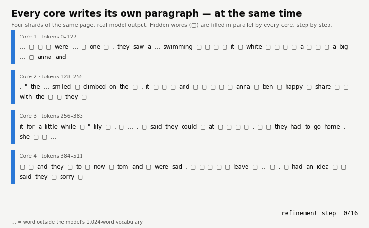
  </picture>
</p>

A full-attention Transformer compares tokens across the whole prompt. SeedPlane bounds each worker's view to its shard
window, reducing attention work and making prompt processing parallelizable at the cost of long-range context.

---

## Results

### Faster, without getting worse

<p align="center">
  <picture>
    <source media="(prefers-color-scheme: dark)" srcset="docs/img/quality-dark.svg">
    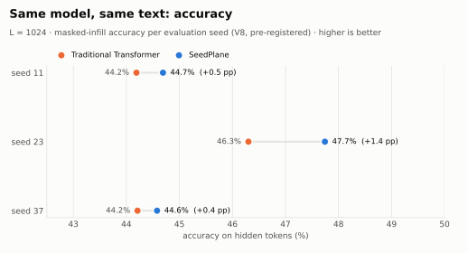
  </picture>
</p>

### More tokens per second on every core count

<p align="center">
  <picture>
    <source media="(prefers-color-scheme: dark)" srcset="docs/img/tokens_per_second-dark.svg">
    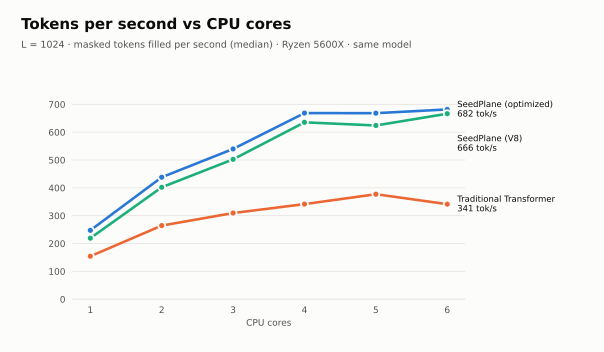
  </picture>
</p>

**1.6× faster on a single core, 2.0× on six.** The traditional Transformer stops scaling around 5 cores; SeedPlane's shards are independent, so each core gets its own work.

<p align="center">
  <picture>
    <source media="(prefers-color-scheme: dark)" srcset="docs/img/scaling-dark.svg">
    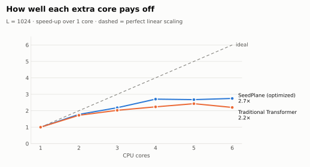
  </picture>
</p>

### GPU, CPU and a second computer — together

The same page, split across an Intel Arc B580, Ryzen cores and Apple M4 cores over the local network, synchronized every step. Output tokens are identical on every combination.

<p align="center">
  <picture>
    <source media="(prefers-color-scheme: dark)" srcset="docs/img/devices_throughput-dark.svg">
    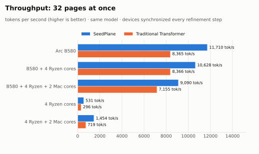
  </picture>
</p>

**More throughput than the traditional Transformer on every device set — 1.4× on the GPU, 2.0× on CPUs across two machines.** CPUs from different computers add up well: 4 Ryzen + 2 Mac cores deliver 2.7× the throughput of the Ryzen cores alone.

<p align="center">
  <picture>
    <source media="(prefers-color-scheme: dark)" srcset="docs/img/devices_latency-dark.svg">
    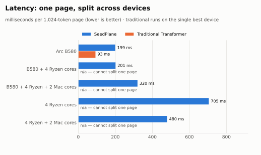
  </picture>
</p>

**Honest limits:** for a single page on a GPU, the traditional Transformer is 2.1× faster; and pairing a fast GPU with slow CPUs only adds waiting. SeedPlane's sweet spot is throughput anywhere and combining ordinary CPUs.

### Longer text: where the GPU story flips

<p align="center">
  <picture>
    <source media="(prefers-color-scheme: dark)" srcset="docs/img/long_text_gpu-dark.svg">
    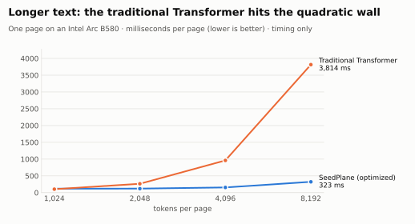
  </picture>
</p>

On a GPU, full attention is fine at 1,024 tokens — but its cost explodes with length. **At 8,192 tokens SeedPlane is 11.8× faster (323 ms vs 3,814 ms)**; the crossover is at 2,048 tokens. *Timing only:* the long-context model trained for this test did not learn well enough to judge quality, so quality on long real text is being measured next on a pre-trained Qwen model.

### The price: memory

<p align="center">
  <picture>
    <source media="(prefers-color-scheme: dark)" srcset="docs/img/memory-dark.svg">
    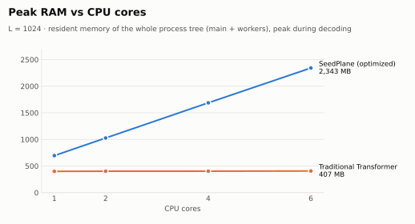
  </picture>
</p>

Today every SeedPlane core is a separate process with its own copy of the runtime and model (~330 MB each). The compute is cheap; the duplication is not — sharing one copy across cores is the next optimization.


### Where it loses — on purpose, in public

When the answer sits several shards away, a shard simply cannot see it. We built a task that forces exactly that:

<p align="center">
  <picture>
    <source media="(prefers-color-scheme: dark)" srcset="docs/img/long_range-dark.svg">
    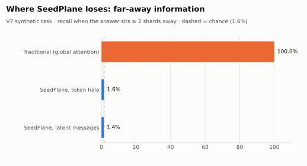
  </picture>
</p>

**SeedPlane shines when context is local** (like the short stories we measured on) and is **not** a drop-in replacement when a text must connect ideas far apart. Closing that gap is the next experiment.

---

## Science in the open

No hidden footnotes: every experiment has its pass/fail criteria written *before* the numbers are seen, and every miss stays in the history.

| | Question | Verdict |
|---|---|---|
| **V16** | Can every useful device add throughput without slowing short requests? | ✅ B580 + Mac both used at measured break-even · ✅ +5.79% and +5.18% on 18 × 4k requests · ❌ forcing both at 17 loses 1.7% |
| **V15** | Can network-aware scheduling remove the Mac regression on short prompts? | ✅ 4k: 0.999× B580 alone vs 0.928× former plan · ✅ 8k: 1.001× · ✅ Mac retained at 16k: 1.018× |
| **V14** | Exact pipeline (layers split over B580 + CPU + Mac via llama.cpp RPC), planner vs default split | ✅ planner 48× faster than llama.cpp's default split · results in progress |
| **V13d** | Does the quality hold at 32k tokens? | ❌ no: +2.2% (3.2×) to +6.2% (4.9×) — fixed halo falsified for long texts |
| **V13c** | Speed × quality frontier at 16k | ✅ ≤ 2% quality loss at 2.7× · same quality at 1.84× · ❌ ≤ 5% at ≥ 3× not reached |
| **V13** | SeedPlane on llama.cpp kernels vs native llama.cpp (Qwen2.5-0.5B) | ✅ 5.0× at 16k, 9.3× at 32k · ✅ KV constant · ❌ +17–29% perplexity with small halo · ❌ CPU next to a 74× faster GPU contributes ~0 |
| **V12** | Qwen2.5 (not trained for SeedPlane) in our PyTorch engine | ❌ 0.81× llama.cpp speed · ✅ windows faster than full attention in the same engine · ❌ +13% perplexity (WikiText, 4k) |
| **V8** | Same model — faster *and* at least as good? | ✅ 2.0× faster · +0.4 to +1.4 pp · lower loss |
| **V9** | Faster than the traditional Transformer on every core count, 1 → 6? | ✅ 1.6× to 2.0× faster, identical output to V8 · ❌ optimizations gained only 4–6% (10% needed) · ⚠️ uses 1.7–5.8× more RAM |
| **V11** | GPU: vectorized kernels + long text | ✅ 1.8× faster GPU kernels · ✅ 11.8× faster than traditional at 8,192 tokens (timing) · ❌ still 1.15× slower at 1,024 · ❌ long-context model failed to train (quality pending) |
| **V10** | Does it scale across GPU + CPU + a second computer? | ✅ beats traditional on throughput in all 5 device sets · ✅ identical output on every device · ❌ single page on GPU: traditional 2.1× faster · ❌ adding slow CPUs to a GPU hurts |
| V7 | Can shards recall far-away information? | ❌ not with halos or latent messages (yet) |
| V6 | Same question on TinyStories | ⚪ inconclusive — too little long-range signal |
| V5 | Is the message router safe? | ✅ 0 invalid updates accepted out of 54,000 adversarial ones |
| V4 | Do Hadamard keys route messages? | ❌ equivalent to plain IDs → replaced |
| — | Early claims ("3.5×", "+16.97%") | ❌ retracted after re-testing |

<details>
<summary><b>More detail: routing safety, attention cost, checkpoints, lessons</b></summary>

**Routing integrity (V5, 3 seeds × 6,000 messages per fault type)**

| Fault injected | Hadamard keys (V4) | Boundary ID only | **Versioned envelope (V5)** |
|---|:---:|:---:|:---:|
| Foreign boundary | rejected | rejected | **rejected** |
| Modulo-32 collision | accepted | rejected | **rejected** |
| Stale generation | accepted | accepted | **rejected** |
| Wrong request / version / target / source | accepted | accepted | **rejected** |
| Duplicate | accepted | accepted | **rejected** |

Live concurrency test: **0 / 120** stale model outputs accepted, **120 / 120** current ones kept.

**Attention pairs computed** (exact arithmetic): L=1024 → 1,048,576 global vs 163,840 SeedPlane (6.4×) · L=8192 → 67,108,864 vs 1,310,720 (51×).

**Checkpoints**

| File | What it is |
|---|---|
| `checkpoints/v6_mdlm_d256_l6_seed1.pt` | 5.3M-param masked-diffusion denoiser used in V6/V8 — learns real context (loss 1.70 vs 5.10 unigram) |
| `checkpoints/clmp_parity_ctx1024.pt` | Original 85k-param toy — context-blind (kept for the record; see `experiments/v6/check_original_checkpoint.py`) |

**Lessons:** Hadamard orthogonal keys reduce to `boundary_id % 32`, so explicit envelopes replaced them. A 1,024-token sequence has 8 shards, so at most 8 cores do useful work per page. Model quality must always be checked against a word-frequency baseline — it caught a context-blind checkpoint.

</details>

---

## Quickstart

```bash
git clone https://github.com/robson-apk/SeedPlane.git
cd SeedPlane
python3 demo.py                     # zero-dependency layout tour (not a benchmark)
python3 -m pip install --upgrade pip
python3 -m pip install -e .
seedplane --help
```

The demo explains the current shard/halo layout without claiming measured performance. Real-model usage and native
worker build instructions are in [docs/API.md](docs/API.md).

<details>
<summary>Reproduce the experiments</summary>

```bash
python3 -m pip install -r requirements.txt
# Download the TinyStories validation split and save it as data/TinyStories-valid.txt.
# The cache is built locally on the first run and is intentionally git-ignored.
python3 experiments/v8/v8.py --cache data/tinystories_word1024_cache.pt --ckpt checkpoints/v6_mdlm_d256_l6_seed1.pt
python3 experiments/v7/v7.py train_a && python3 experiments/v7/v7.py train_b && python3 experiments/v7/v7.py eval
python3 docs/record_trajectory.py && python3 docs/make_gifs.py && python3 docs/make_charts.py
```

Every experiment folder has `PROTOCOL.md` (criteria, written first), the code, raw `results/`, and `RESULTS.md`.

</details>

<details>
<summary>Repository layout</summary>

```text
SeedPlane/
├── demo.py            # zero-dependency shard/halo layout tour
├── seedplane/         # CLI, shard planner, converters, PyTorch engines, native front end
├── native/            # seedplane-worker (llama.cpp) and vulkan_decode (the native SeedPlane runtime)
├── checkpoints/       # original toy + V6 denoiser
├── experiments/       # v4 … v21 — protocol, code, raw results, verdict
├── docs/              # charts, GIFs and the scripts that render them
└── data/              # local corpus/cache (git-ignored)
```

</details>

---

## Cite & support

```bibtex
@software{seedplane2026,
  author = {Robson},
  title  = {SeedPlane: Parallel Long-Context Prefill Across Heterogeneous Devices},
  url    = {https://github.com/robson-apk/SeedPlane},
  year   = {2026}
}
```

MIT licensed. If this research is useful to you:

[](https://buymeacoffee.com/robson.apk)
